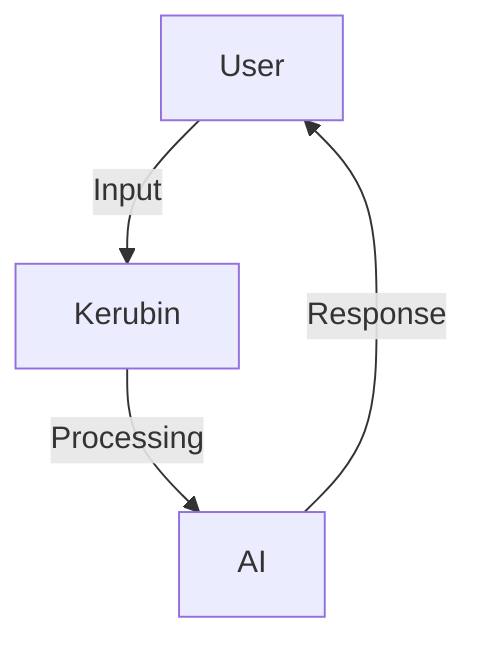

# 🌌 **Kerubin - Intelligent Virtual Assistant**


> 💬 **"Transforming common interactions into extraordinary experiences!"**

---

## 🎨 **Visual Highlights**

1. **Dynamic Visualization**:  
   - Interactive previews with short videos or GIFs showcasing key features.  
2. **Modular Components**:  
   - Collapsible sections to explore technical details only when needed.  
3. **Custom Graphics**:  
   - Embedded Mermaid.js diagrams.  

---

## 📌 **Overview**

**Kerubin AI** is an open-source virtual assistant combining **cutting-edge AI technology** with an elegant graphical interface. Designed to cater to multiple scenarios, it is:  
- **Contextual**: Offers personalized responses with persistent memory.  
- **Efficient**: Asynchronous support for optimized performance.  
- **Customizable**: Adaptable to user needs.  

---

## 🗺️ **Navigation**

| 🌟 Section                        | 📖 Description                                 |
|-----------------------------------|-----------------------------------------------|
| [🛠 Architecture](#-architecture) | Project structure and main modules            |
| [🚀 Features](#-features)         | Unique resources and differentials            |
| [💻 Technologies](#-technologies) | Tools and libraries used                      |
| [⚙️ Installation](#️-installation)| Step-by-step guide to running the project     |
| [📈 Expansions](#-future-improvements)| Ideas for enhancements                     |
| [👥 Contributors](#-contributors) | Who helped build this project                 |
| [📜 License](#-license)           | License details                               |

---

## 🛠 **Architecture**

### 🔹 **User Interface**  
- Responsive sidebar.  
- **Embedded Markdown Editor** with graphics support.  

### 🔹 **Language Processing**  
- Integration with modern APIs, multilingual support.  

### 🔹 **Data Management**  
- Real-time history, automatic backup.  

> 💡 Check the diagram below to understand the system flow:  



---

## 🚀 **Features**

### 🔥 **Why is Kerubin different?**
- **🔍 Contextual Search**: Provides detailed responses adapted to history.  
- **🎨 Customizable Design**: Toggle between dark/light themes.  
- **📊 Dynamic Visualizations**: ASCII graphics and real-time statistics.  

---

## 💻 **Technologies Used**


---

## ⚙️ **Installation**

Follow this simple guide:

1. Clone the repository:  
   ```bash
   git clone https://github.com/your-username/kerubin.git
   ```
2. Install dependencies:  
   ```bash
   pip install -r requirements.txt
   ```
3. Configure your `.env` file.  

4. Run the program:  
   ```bash
   python main.py
   ```

---

## 📈 **Future Improvements**

1. **🛠 Extensibility**: Add plugins for task automation.  
2. **🗣 Voice Recognition**: Control with voice commands.  
3. **📡 Open API**: Allow integration with third-party systems.  

---

## 🤝 **Contributors**

[](https://github.com/your-username/kerubin/graphs/contributors)

---

## 🎨 **Innovative Extras**

1. **Exclusive Badges**  
      

2. **Collaboration Map**  
   ```mermaid
   graph TD;
   Dev1-->Kerubin;
   Kerubin-->Dev2;
   Dev2-->Community;
   ```

--- 
