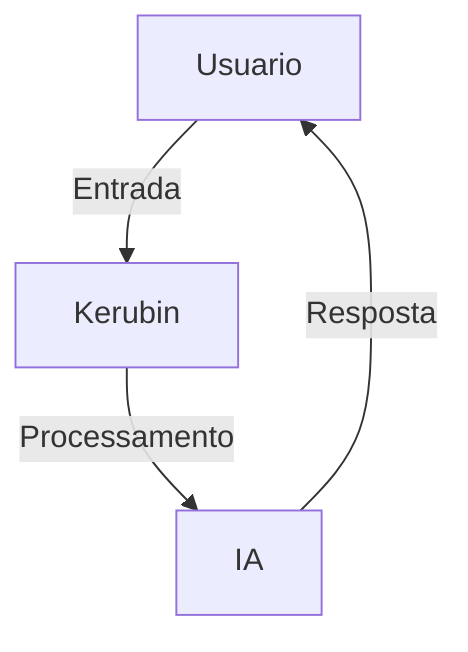

# 🌌 **Kerubin - Assistente Virtual Inteligente**

> 💬 **"Transformando interações comuns em experiências extraordinárias!"**

---

## 🎨 **Destaques Visuais**

1. **Visualização Dinâmica**: 
   - Pré-visualizações interativas com vídeos curtos ou GIFs mostrando funcionalidades chave.
2. **Componentes Modulares**:
   - Seções colapsáveis para explorar detalhes técnicos apenas quando necessário.
3. **Gráficos Personalizados**:
   - Diagramas em Mermaid.js embutidos.

---

## 📌 **Visão Geral**

**Kerubin AI** é um assistente virtual de código aberto, que combina **tecnologia de ponta em IA** com uma interface gráfica elegante. Projetado para atender a múltiplos cenários, ele é:
- **Contextual**: Oferece respostas personalizadas com memória persistente.
- **Eficiente**: Com suporte assíncrono para desempenho otimizado.
- **Customizável**: Adaptável às necessidades do usuário.

---

## 🗺️ **Navegação**

| 🌟 Seção                          | 📖 Descrição                                       |
|-----------------------------------|---------------------------------------------------|
| [🛠 Arquitetura](#-arquitetura)    | Estrutura do projeto e módulos principais         |
| [🚀 Funcionalidades](#-funcionalidades)| Recursos únicos e diferenciais                   |
| [💻 Tecnologias](#-tecnologias)    | Ferramentas e bibliotecas utilizadas             |
| [⚙️ Instalação](#️-instalação)     | Passo-a-passo para rodar o projeto               |
| [📈 Expansões](#-melhorias-futuras)| Ideias para aprimoramento                        |
| [👥 Contribuidores](#-contribuidores)| Quem ajudou a construir essa obra                |
| [📜 Licença](#-licença)            | Detalhes da licença                              |

---

## 🛠 **Arquitetura**

### 🔹 **Interface do Usuário** 
- Barra lateral responsiva.
- **Editor Markdown** embutido com suporte a gráficos.

### 🔹 **Processamento de Linguagem**
- Integração com APIs modernas, suporte a múltiplas línguas.

### 🔹 **Gestão de Dados**
- Histórico em tempo real, backup automático.

> 💡 Veja o diagrama abaixo para entender o fluxo do sistema:



---

## 🚀 **Funcionalidades**

### 🔥 **Por que o Kerubin é diferente?**
- **🔍 Busca Contextual**: Responde com detalhes adaptados ao histórico.
- **🎨 Design Personalizável**: Alterne entre temas escuro/claro.
- **📊 Visualizações Dinâmicas**: Gráficos ASCII e estatísticas em tempo real.

---

## 💻 **Tecnologias Utilizadas**


---

## ⚙️ **Instalação**

Siga este guia simples:

1. Clone o repositório:
   ```bash
   git clone https://github.com/seu-usuario/kerubin.git
   ```
2. Instale as dependências:
   ```bash
   pip install -r requirements.txt
   ```
3. Configure seu arquivo `.env`.

4. Execute o programa:
   ```bash
   python main.py
   ```

---

## 📈 **Melhorias Futuras**

1. **🛠 Extensibilidade**: Adicionar plugins para automação de tarefas.
2. **🗣 Reconhecimento de Voz**: Controle por comandos de voz.
3. **📡 API Aberta**: Permitir integração com sistemas de terceiros.

---

## 🤝 **Contribuidores**

[](https://github.com/seu-usuario/kerubin/graphs/contributors)

---

## 🎨 **Informações extras**

1. **Status**
    

2. **Mapa de Colaboração**
   ```mermaid
   graph TD;
   Dev1-->Kerubin;
   Kerubin-->Dev2;
   Dev2-->Comunidade;
   ```

